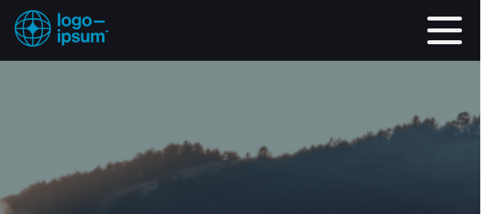
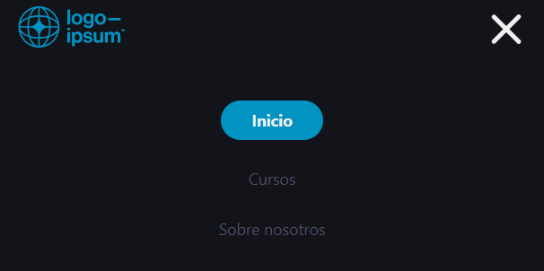
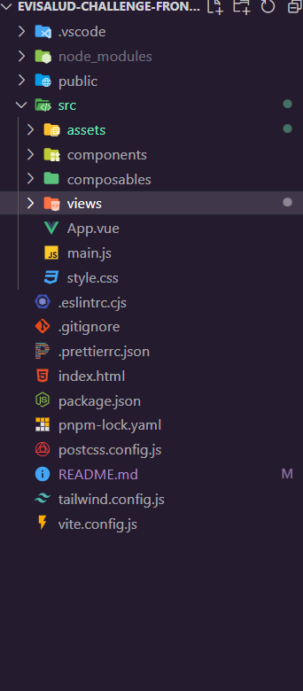
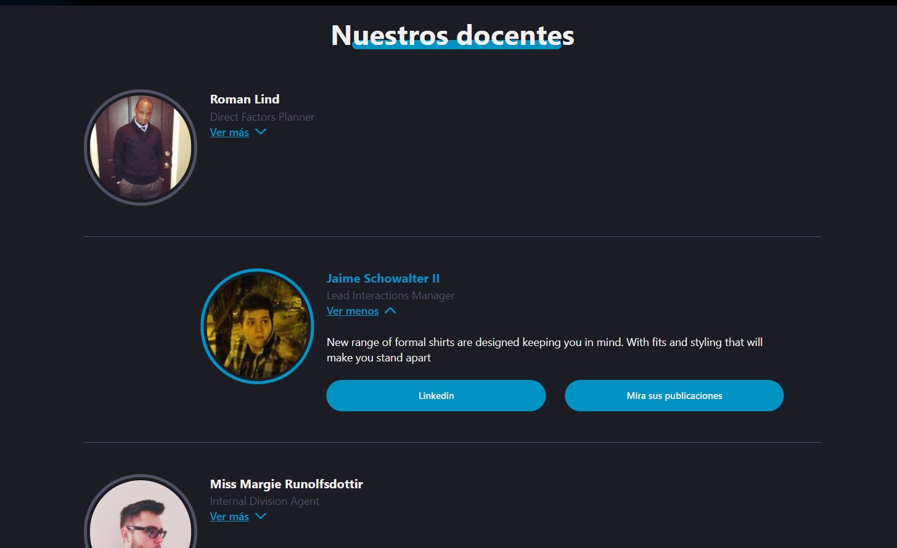
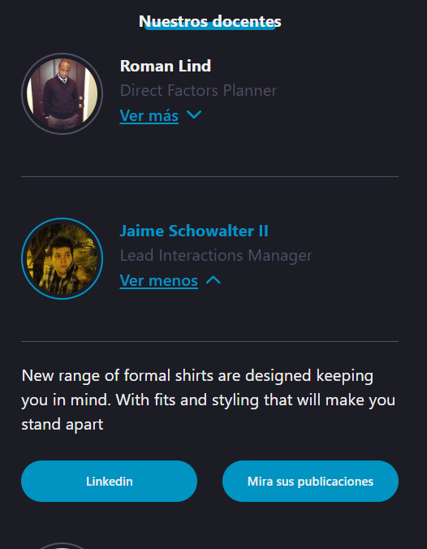
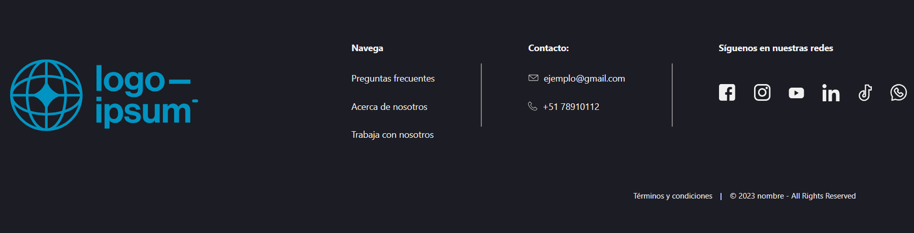
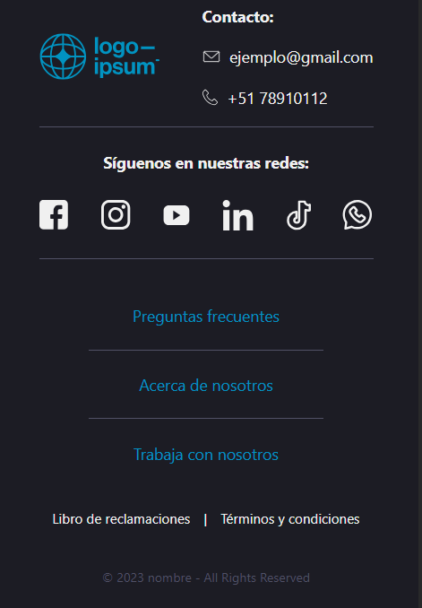

# Evisalud-challenge-frontend

> Reto para puesto de trabajo concistente en una landing page urilizando vue.

# Tecnologías aplicadas

Para la creación de la pagina se utilizó vue 3 como framework de trabajo y el estilo de API utilizado fue el Composition API, Vite como iniciador de projecto y para la creación y diseño de estilos de la pagina se implementó Tailwindcss. para el fetching de datos se utilizó axios js.

Se optó por crear la aplicación en modo mobile first a una resolución de 375px de ancho.

# Procedimiento y estrategia

La aplicación esta pensada para ser escalable al modularizar los componentes y trabajar en la landing page como vista para una futura implementacion de vue router. Se configuró ciertas clases nuevas para implementarlas con tailwind tales como la paleta de colores de las paginas.

Se usó puramente tailwind y js para la creación de estios inamiaciónes tales como el boton del menu hamburguesa para mobiles

> > En sintesis, la aplicación quedó ordenada y proyectada a ser expandida

# Dato de profesores

Se optó por traer los datos desde la api que se entregó usando axios para ello. Esta parte del proyecto se modularizó para dejarlo dentro de un componente llamado TeacherProfile, este renderiza la data, el formato en el cual se entrega es una lista que tiene animación.

> Desktop mode
> 

> Mobile mode
> 

# NavBar y Footer

Se modularizó tanto el menu de navegación como el footer y estas se encuentran renderizadas dentro del archivo app como parte de la plantilla general, asi solamente lo que esta dentro de la etiqueta "main" será lo que se deba cambiar para las siguientes páginas.

Asi quedaron estas dos:

> NavBar Desktop
> 

> NavBar Mobile
> 

> Footer Desktop
> 

> Footer Mobile
> 

# Retos

Propuse armar las animaciones por mi cuenta armando la logica de cada parte, así nació el menu hamburguesa y el display en forma de acordión del modulo de teachers.

# Conclusión

En resumen, este reto fue una gran oportunidad de sacar mi potencial y poder mostrar lo que he aprendido y lo que puedo seguir aprendiendo, me gustaría adentrarme más, conociendo cada dia mas y aprendiendo a hacer el trabajo cada dia mas eficientemente. Esta oportunidad de trabajo es una gran forma de seguir reforzando mis conocimientos y adquirir nuevos.

# Aplicación desplegada

_in contruction_
